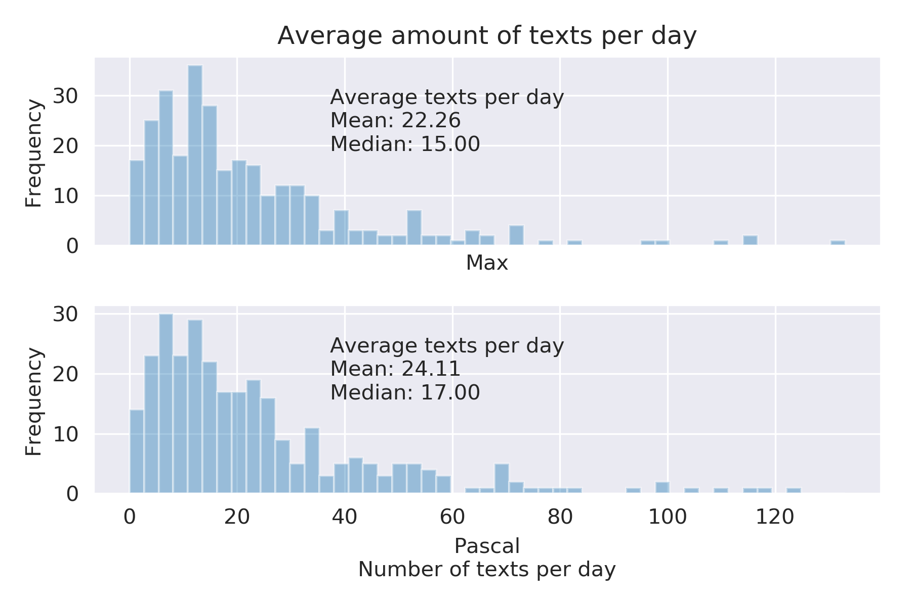
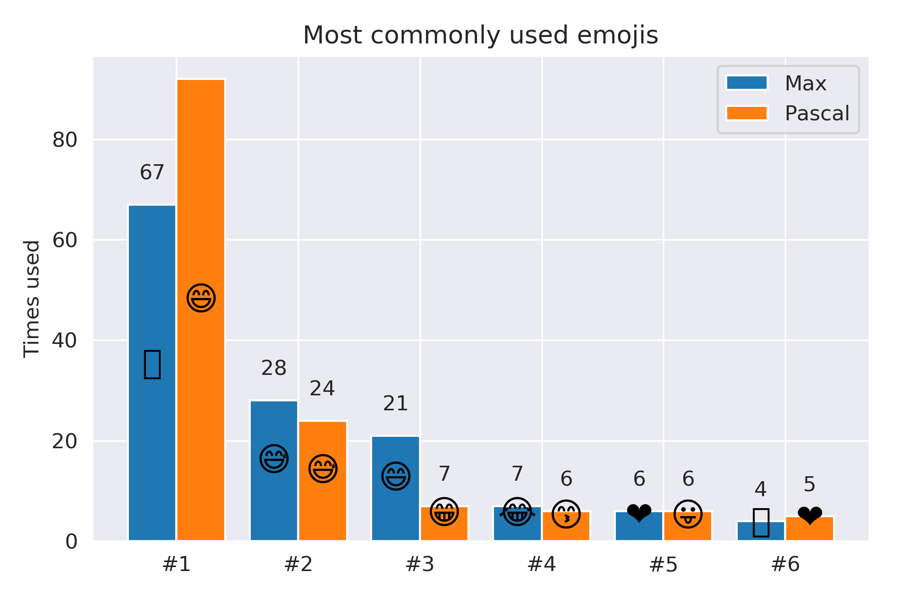

# Whatsapp Chat Analysis
This project analyses an exported WhatsApp chat history and extracts summary statistics

## Introduction
Did you ever wonder how much you chat with your best friend or significant other? How many texts do you send per day? How many words per text? What day of the week or time of the day do you text most and which words or emojis are typical for you?
In this project we'll find out! If you want to read basically the same document but with the code, read it in this [Jupyter Notebook](WhatsAppAnalysis.ipynb).

For this demonstration I've replaced the texts in a chat with a friend using just Lorem Ipsum text, but retained emojis and `<Media omitted>` markers to get a realistic, yet anonymous example file. For those who wonder who Max Mustermann is; that name is basically the German version of John Doe.

# Table of Contents
- [Introduction](#introduction)
- [How many?](#how-many)
- [When?](#when)
- [Which words?](#which-words)

# How many?
The most obvious first: How many messages were sent in total by each sender?

Let's have a look at the average amount of words per text.

Looks like we mostly just use a few words per text, but sometime we get very verbose. 
Let's look at the distribution of how many texts were send each day.
Is there a significant difference between the distributions of the two chatters?

# When?
Now that we know how many texts per day we send on average, let's find out if the amount varies between the different days of the week.

It looks lie we are texting more in our free time on Sundays and less on Mondays when we're back to work :) 
Now how about our texting behavior according to the hour of the day?

Unsurprisingly, we don't text so much in the middle of the night, a bit more during the day, and a lot more after work in the afternoon and evening. 
Who usually gets up earlier in the morning and sends the first text of the day?

Looks like my friend tends to usually get up a bit earlier than me. 
Now how did our monthly chat behavior develop over the entire time we are connected on WhatsApp?

My friend and I started texting a lot after we first met and then around April 2019 there is a steep drop which corresponds to me moving into my friend's neighborhood which meant we could talk a lot more face-to-face.

# Which words?
Let's collect all words, emojis, count how many media files were sent, and make some plots about the favorite words and emojis. 

Now let's  do the same for the emojis.

How many media files did we send?

That was a lot of fun actually; let me know if you got any other ideas that could be interesting to analyze in WhatsApp chat logs.
Thanks for following me through this project!

